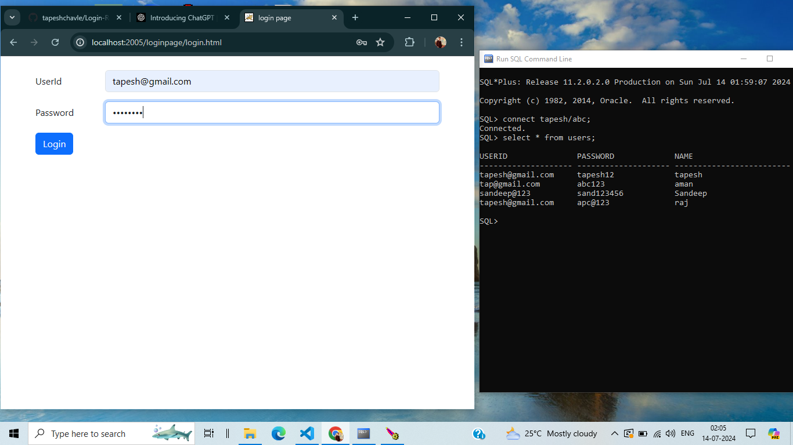
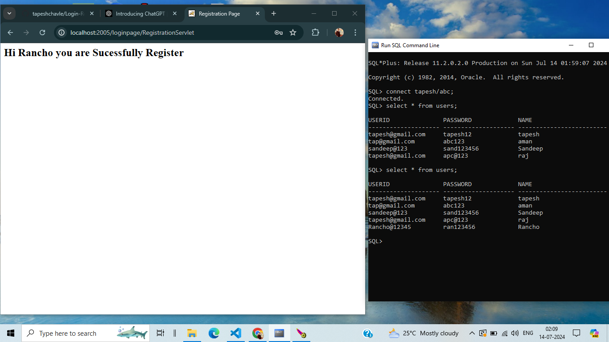

# Login and Registration Application

<h2>Inserting UserId and Password</h2>
 

<h2>When UserId and Password gets sucessfully Match</h2>
 

 <h2>Enter wrong UserId and Password</h2>
 

 <h2>Register new User</h2>
 

 <h2>When new User Register then data successfully insert into Database</h2>
 
